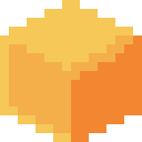

<h1>    
    
    <code>warpedvoxels</code>
</h1>

**Welcome to WarpedVoxels' Git mono-repository!** This is where
development and artistry merge to bring content to life.

We are dedicated to create and use technologies that ensure our
codebase is clean, modern, performant, and developer-friendly.

Our focus is on crafting an immersive experience that captivates
players and pushes the boundaries of Minecraft: Java Edition gameplay.

## 📚 Table of contents

* [🖍 Getting Started]: A guide on setting up a development workflow for
  WarpedVoxels.
* [🧙🏻‍♀️️ Witchcraft]: In-depth explanation of how our in-game effects work
  behind the scenes.
* [📜 Licensing]: Information about the licensing of WarpedVoxels.

[🖍 Getting Started]: https://github.com/WarpedVoxels/java-edition/blob/trunk/docs/getting_started.md

[🧙🏻‍♀️️ Witchcraft]: https://github.com/WarpedVoxels/java-edition/blob/trunk/docs/witchcraft.md

[📜 Licensing]: https://github.com/WarpedVoxels/java-edition/blob/trunk/docs/LICENSE.md

## ⚠️ Disclaimer

Minecraft is intellectual property of Mojang, AB, and it is solely
mentioned for descriptive purposes. WarpedVoxels is not associated with
or endorsed by Mojang, AB.

Any references to Minecraft within this repository are purely for
descriptive purposes to provide context and showcase the work done by
the WarpedVoxels team and community.